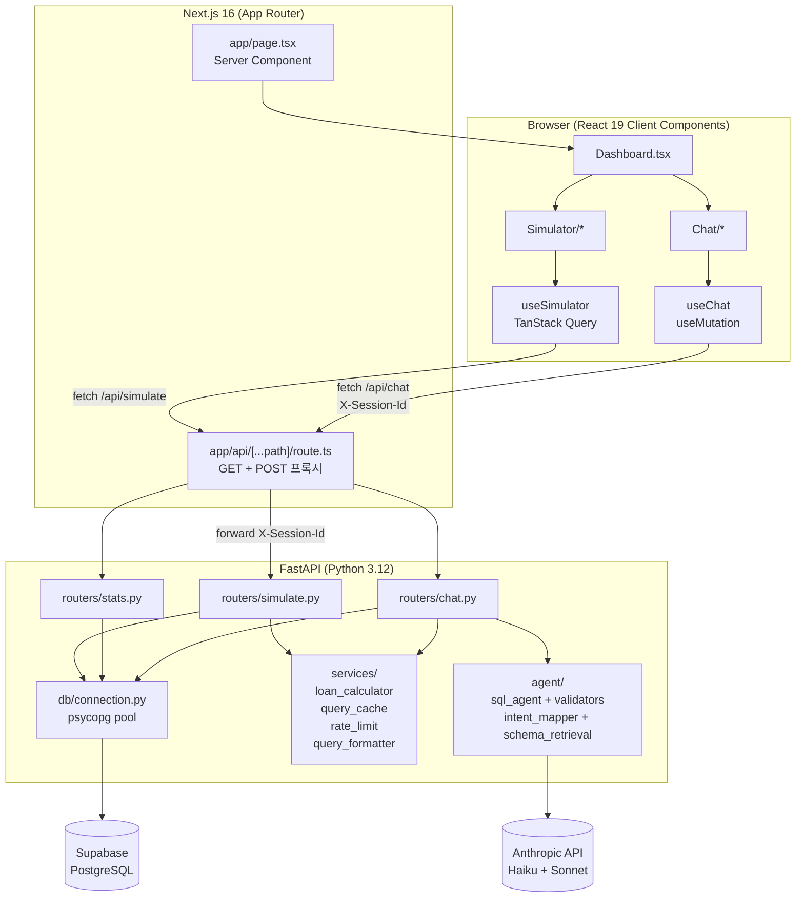
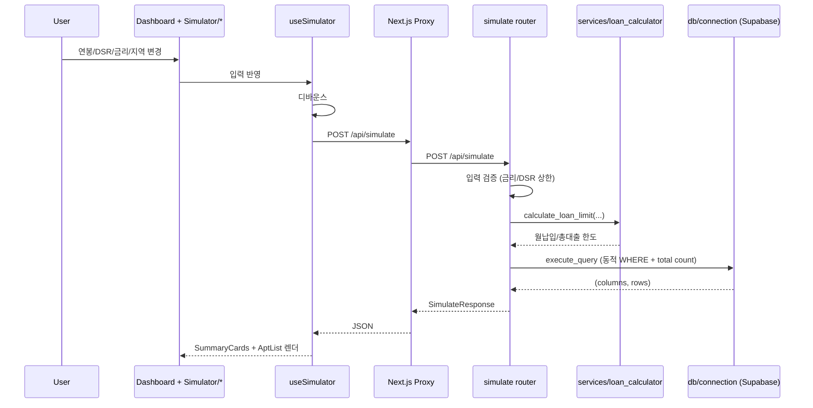
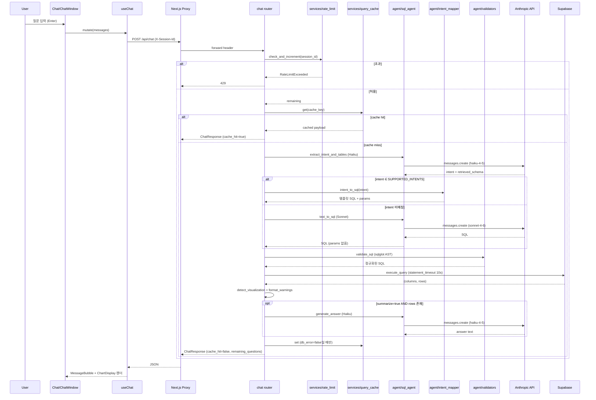
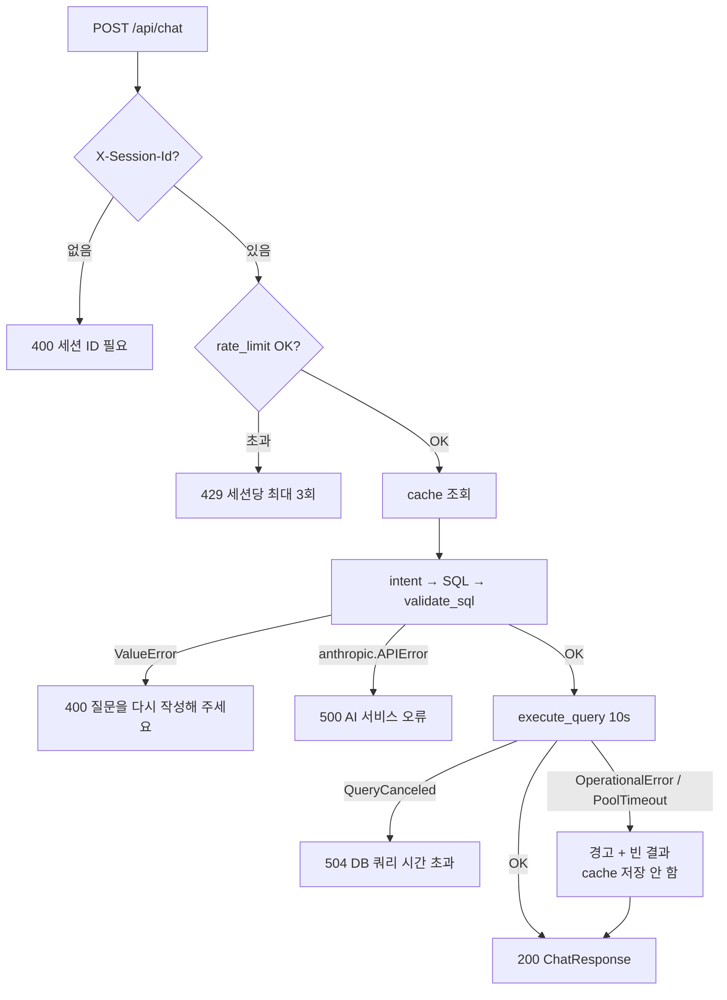

# Request Flow

## Overview

브라우저는 Next.js 16의 App Router 프록시(`apps/web/app/api/[...path]/route.ts`)를 통해 FastAPI 백엔드와 통신한다. Anthropic SDK 호출과 Supabase(PostgreSQL) 연결은 모두 FastAPI 안에서만 일어나며, 클라이언트 번들에는 API 키가 포함되지 않는다. 시뮬레이터는 순수 계산 + DB 조회로 끝나고, 챗봇은 캐시 → 2단계 Claude → sqlglot 검증 → DB 실행을 거친다.

## 전체 아키텍처

상위 컴포넌트와 외부 의존성의 배치. Next.js는 프록시 역할만 하며 비즈니스 로직은 FastAPI에 집중된다.

## 시뮬레이터 플로우

연봉·DSR·금리 입력이 바뀌면 `useSimulator`가 디바운스 후 `/api/simulate`를 호출한다. FastAPI는 `loan_calculator`로 대출 한도를 구하고 Supabase에서 조건에 맞는 아파트를 조회한다. LLM 호출은 없다.

## 챗봇 플로우

챗봇은 세션 ID 검증 → rate limit → 캐시 → intent 추출 → (템플릿 또는 SQL 생성) → sqlglot 검증 → DB 실행 → 요약 생성 → 캐시 저장 순서로 동작한다. 캐시 히트는 LLM 호출을 0회로 만들고, intent 매칭은 Sonnet 호출을 생략한다.

## 에러 처리

응답 실패 경로와 상태 코드. `validate_sql` 실패와 Claude API 오류 모두 **재시도하지 않고** 즉시 전파된다.

| 상태           | 조건                                                                               |
| -------------- | ---------------------------------------------------------------------------------- |
| 400            | `X-Session-Id` 누락, `validate_sql` 실패, intent 필수 파라미터 누락, 미지원 intent |
| 429            | `rate_limit.check_and_increment` 초과 (세션당 3회)                                 |
| 500            | `anthropic.APIError` (Claude 호출 실패)                                            |
| 504            | `psycopg.errors.QueryCanceled` (statement_timeout 10초)                            |
| 200 + warnings | `OperationalError` / `PoolTimeout` (결과 비고, 캐시 저장 스킵)                     |

## 비용 제어 포인트

- 재시도 루프 금지 — `validate_sql` 실패도 Claude API 오류도 즉시 HTTP 예외로 전파된다.
- 캐시 히트 시 LLM 호출 0회, DB 호출 0회. `query_cache`는 TTLCache(1000, 86400s) + `threading.Lock`.
- Intent 매칭 시 Sonnet 호출 생략 — Haiku 1회(extract_intent) + Haiku 1회(summarize)로 종결. 템플릿 SQL은 `intent_mapper.intent_to_sql`이 코드 상수로 반환.
- 서버 세션당 3회 제한(`rate_limit.check_and_increment`) + 클라이언트 `apps/web/lib/session.ts` 3회 제한으로 이중 보호. 캐시 히트도 카운트된다.
- Anthropic API 키는 `apps/server/.env`에만 존재하고 프록시는 해당 헤더를 포워딩하지 않는다.
